# Application Flow Diagram

## Complete Note Processing Workflow

This diagram shows the end-to-end flow from folder import to processed notes display.

```mermaid
flowchart TD
    START([User Starts]) --> IMPORT_CHOICE{Import Method}
    
    %% Web Import Flow
    IMPORT_CHOICE -->|Web Interface| WEB_FORM[Fill Import Form]
    WEB_FORM --> VALIDATE_PATH{Valid Path?}
    VALIDATE_PATH -->|No| WEB_FORM
    VALIDATE_PATH -->|Yes| SCAN_FILES[Scan Directory for Supported Files]
    
    %% CLI Import Flow
    IMPORT_CHOICE -->|CLI Command| CLI_IMPORT[artisan notes:process --path]
    CLI_IMPORT --> SCAN_FILES
    
    %% File Processing
    SCAN_FILES --> CHECK_FILES{Files Found?}
    CHECK_FILES -->|No| ERROR_NO_FILES[Error: No Supported Files]
    CHECK_FILES -->|Yes| COPY_FILES[Copy Files to Storage]
    
    COPY_FILES --> CREATE_FOLDER[Create Folder Record]
    CREATE_FOLDER --> CREATE_NOTES[Create Note Records]
    CREATE_NOTES --> IMPORT_COMPLETE[Import Complete]
    
    %% Processing Flow
    IMPORT_COMPLETE --> PROCESS_CHOICE{Processing Method}
    PROCESS_CHOICE -->|Automatic| AUTO_PROCESS[artisan notes:process]
    PROCESS_CHOICE -->|Manual Trigger| MANUAL_PROCESS[artisan notes:process --folder=ID]
    
    AUTO_PROCESS --> GET_UNPROCESSED[Get Unprocessed Notes]
    MANUAL_PROCESS --> GET_FOLDER_NOTES[Get Folder Notes]
    
    GET_UNPROCESSED --> PROCESS_LOOP[For Each Note]
    GET_FOLDER_NOTES --> PROCESS_LOOP
    
    %% AI Processing Loop
    PROCESS_LOOP --> READ_CONTENT[Read Note Content]
    READ_CONTENT --> ANALYZE_CONTENT[LLM: Analyze & Categorize]
    ANALYZE_CONTENT --> API_SUCCESS{API Success?}
    
    API_SUCCESS -->|No| FALLBACK_CATEGORY[Use Fallback Category]
    API_SUCCESS -->|Yes| CREATE_CATEGORY[Create/Find Category]
    
    FALLBACK_CATEGORY --> CREATE_SUBCATEGORY[Create/Find Subcategory]
    CREATE_CATEGORY --> CREATE_SUBCATEGORY
    
    CREATE_SUBCATEGORY --> SUMMARIZE[LLM: Summarize Content]
    SUMMARIZE --> SUMMARY_SUCCESS{Summary Success?}
    
    SUMMARY_SUCCESS -->|No| FALLBACK_SUMMARY[Use Fallback Summary]
    SUMMARY_SUCCESS -->|Yes| CREATE_PROCESSED[Create Processed Note]
    
    FALLBACK_SUMMARY --> CREATE_PROCESSED
    CREATE_PROCESSED --> MARK_PROCESSED[Mark Note as Processed]
    MARK_PROCESSED --> UPDATE_COUNTS[Update Category Counts]
    UPDATE_COUNTS --> MORE_NOTES{More Notes?}
    
    MORE_NOTES -->|Yes| PROCESS_LOOP
    MORE_NOTES -->|No| PROCESSING_COMPLETE[Processing Complete]
    
    %% Display Flow
    PROCESSING_COMPLETE --> VIEW_CHOICE{View Method}
    VIEW_CHOICE -->|Dashboard| DASHBOARD[View Dashboard with Categories]
    VIEW_CHOICE -->|Category View| CATEGORY_VIEW[View Notes by Category]
    VIEW_CHOICE -->|Search| SEARCH[Search Notes]
    VIEW_CHOICE -->|Individual Note| NOTE_VIEW[View Processed Note]
    
    %% Dashboard Details
    DASHBOARD --> SHOW_STATS[Show Processing Statistics]
    DASHBOARD --> LIST_CATEGORIES[List Categories with Counts]
    
    %% Category View Details
    CATEGORY_VIEW --> FILTER_BY_CATEGORY[Filter Notes by Category]
    FILTER_BY_CATEGORY --> SHOW_SUBCATEGORIES[Show Subcategories]
    SHOW_SUBCATEGORIES --> PAGINATED_NOTES[Show Paginated Notes]
    
    %% Search Details
    SEARCH --> SEARCH_QUERY[Enter Search Query]
    SEARCH_QUERY --> SEARCH_RESULTS[Search in Titles & Summaries]
    
    %% Note View Details
    NOTE_VIEW --> SHOW_DETAILS[Show Title, Summary, Key Points]
    SHOW_DETAILS --> SHOW_METADATA[Show Original File Info]
    
    %% Error States
    ERROR_NO_FILES --> END([End])
    DASHBOARD --> END
    CATEGORY_VIEW --> END
    SEARCH --> END
    NOTE_VIEW --> END
    
    %% Styling
    classDef startEnd fill:#4caf50,stroke:#2e7d32,color:#fff
    classDef process fill:#2196f3,stroke:#1565c0,color:#fff
    classDef decision fill:#ff9800,stroke:#ef6c00,color:#fff
    classDef error fill:#f44336,stroke:#c62828,color:#fff
    classDef ai fill:#9c27b0,stroke:#6a1b9a,color:#fff
    classDef storage fill:#607d8b,stroke:#37474f,color:#fff
    
    class START,END startEnd
    class WEB_FORM,CLI_IMPORT,SCAN_FILES,COPY_FILES,CREATE_FOLDER,CREATE_NOTES,GET_UNPROCESSED,GET_FOLDER_NOTES,READ_CONTENT,CREATE_PROCESSED,MARK_PROCESSED,UPDATE_COUNTS,DASHBOARD,CATEGORY_VIEW,SEARCH,NOTE_VIEW process
    class IMPORT_CHOICE,VALIDATE_PATH,CHECK_FILES,PROCESS_CHOICE,API_SUCCESS,SUMMARY_SUCCESS,MORE_NOTES,VIEW_CHOICE decision
    class ERROR_NO_FILES error
    class ANALYZE_CONTENT,SUMMARIZE,CREATE_CATEGORY,CREATE_SUBCATEGORY,FALLBACK_CATEGORY,FALLBACK_SUMMARY ai
    class IMPORT_COMPLETE,PROCESSING_COMPLETE storage
```

## Workflow Phases

### 1. Import Phase
- **Web Interface**: Users fill form with directory path and optional name
- **CLI Interface**: Direct command execution with path parameter
- **Validation**: Path existence and readability checks
- **File Discovery**: Scan for supported formats (txt, md, pdf, rtf)
- **Storage**: Copy files to Laravel storage with metadata preservation

### 2. Processing Phase
- **Trigger Methods**: Automatic processing or manual folder-specific processing
- **Content Analysis**: OpenAI API integration for categorization
- **Summarization**: AI-generated titles, summaries, and key points
- **Data Creation**: Categories, subcategories, and processed notes
- **Error Handling**: Fallback responses for API failures

### 3. Display Phase
- **Dashboard**: Overview with statistics and category navigation
- **Category Views**: Filtered notes with pagination
- **Search**: Full-text search across titles and summaries
- **Individual Notes**: Detailed view with metadata

## Key Features

- **Fault Tolerance**: Fallback categorization and summarization
- **Batch Processing**: Progress bars and configurable limits
- **Transaction Safety**: Database transactions for consistency
- **File Management**: Duplicate handling and timestamp preservation
- **Scalability**: Pagination and indexed database queries

*Generated on: 2025-08-17*