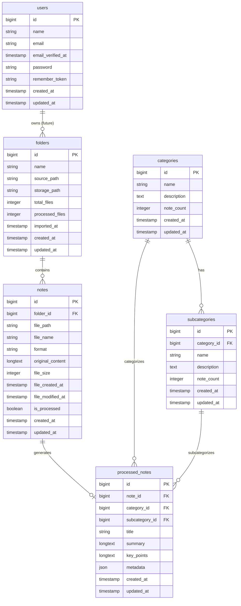

# Database Entity Relationship Diagram (ERD)

## Note Processor Database Schema

This diagram shows the relationships between all database tables in the Note Processor application.

## Key Relationships

1. **Folders → Notes**: One folder can contain many notes (1:N)
2. **Notes → Processed Notes**: Each note can have one processed version (1:1)
3. **Categories → Subcategories**: One category can have many subcategories (1:N)
4. **Categories → Processed Notes**: One category can contain many processed notes (1:N)
5. **Subcategories → Processed Notes**: One subcategory can contain many processed notes (1:N)

## Database Indexes

- `notes.file_path` - For quick file lookup
- `notes.is_processed` - For filtering processed/unprocessed notes
- `folders.imported_at` - For chronological folder listing
- `processed_notes.category_id, subcategory_id` - For category-based queries

## Foreign Key Constraints

- `notes.folder_id` → `folders.id` (CASCADE DELETE)
- `processed_notes.note_id` → `notes.id` (CASCADE DELETE)
- `processed_notes.category_id` → `categories.id` (CASCADE DELETE)
- `processed_notes.subcategory_id` → `subcategories.id` (SET NULL)
- `subcategories.category_id` → `categories.id` (CASCADE DELETE)

*Generated on: 2025-08-17*