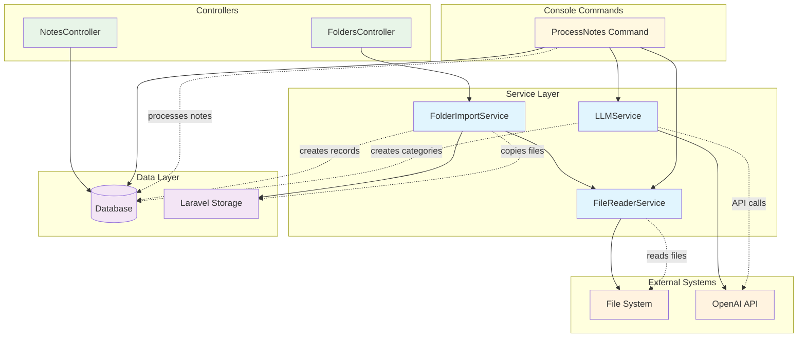

# Service Architecture Diagram

## Note Processor Service Layer

This diagram shows the service layer architecture and how services interact with each other and external APIs.

## Service Descriptions

### FileReaderService
- **Purpose**: Handles file system operations and content extraction
- **Capabilities**:
  - Scans directories for supported file formats (txt, md, pdf, rtf)
  - Reads file content with format-specific handling
  - Extracts file metadata (size, timestamps)
  - PDF text extraction using Spatie/PdfToText

### FolderImportService
- **Purpose**: Manages the complete folder import workflow
- **Capabilities**:
  - Validates source directories
  - Copies files to Laravel storage
  - Creates folder and note database records
  - Handles duplicate filename resolution
  - Preserves file timestamps
  - Provides import statistics

### LLMService
- **Purpose**: Integrates with OpenAI for AI-powered note processing
- **Capabilities**:
  - Analyzes content for automatic categorization
  - Generates summaries and key points
  - Creates/finds categories and subcategories
  - Handles API failures with fallback responses
  - JSON response validation

## Service Interactions

1. **Import Flow**: `FolderImportService` → `FileReaderService` → File System
2. **Processing Flow**: `ProcessNotes Command` → `LLMService` → OpenAI API
3. **Content Reading**: `FileReaderService` → File System (various formats)
4. **Category Management**: `LLMService` → Database (categories/subcategories)

## External Dependencies

- **OpenAI API**: For content analysis and summarization
- **Spatie/PdfToText**: For PDF content extraction
- **Laravel Storage**: For file management
- **SQLite Database**: For data persistence

*Generated on: 2025-08-17*